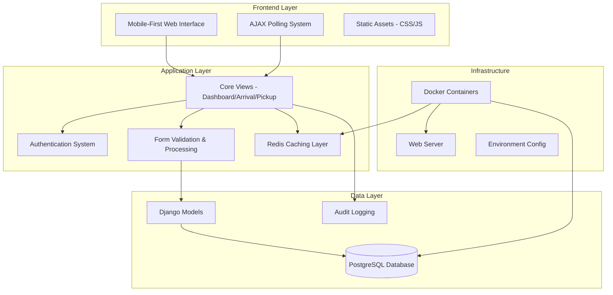
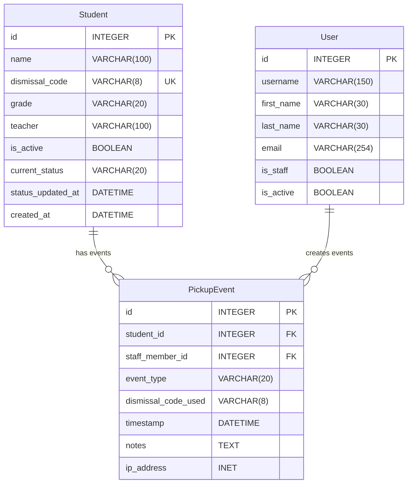
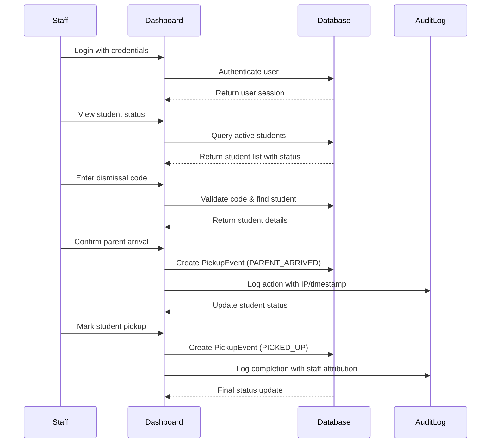

# OpenDismissal MVP - Final Implementation Plan

**Team Lead:** Jake Thompson  
**Implementation Date:** August 4, 2025  
**Based on:** Jake Thompson v2.0 Plan (9.5/10 rating from comprehensive review)  
**Timeline:** 2-3 weeks parallel development

## Executive Summary

This plan implements the highest-rated MVP approach from our comprehensive planning review, balancing rapid delivery with production readiness. Three developers will work in parallel on separate branches, ensuring security, performance, and compliance from day one.

**Key Success Factors:**  
- ✅ **Security-first approach** - Authentication, CSRF protection, audit logging built-in  
- ✅ **Simplified architecture** - 2 core models with optimized performance  
- ✅ **Mobile-first design** - Responsive interface for outdoor dismissal use  
- ✅ **Production-ready** - Docker deployment with proper caching and monitoring

## Architecture Overview

### High-Level System Architecture



### Database Schema Design



### Core Workflow Process



## Team Structure & Parallel Development

### Developer Assignment Matrix

| Developer | Primary Focus | Branch Name | Key Deliverables |
|-----------|---------------|-------------|------------------|
| **Developer 1** | Backend Foundation | `feature/backend-foundation` | Models, Auth, Admin, Database |
| **Developer 2** | Core Business Logic | `feature/core-views` | Views, Forms, Security, APIs |
| **Developer 3** | Frontend & UX | `feature/frontend-templates` | Templates, CSS, JavaScript, Mobile |

### Integration Points & Dependencies

```mermaid
gantt
    title OpenDismissal MVP Development Timeline
    dateFormat  X
    axisFormat %w
    
    section Backend Foundation
    Project Setup & Models     :done, setup, 0, 2
    Authentication System      :done, auth, 2, 4
    Admin & Demo Data         :demo, 4, 6
    
    section Core Business Logic
    Core Views Development     :views, 1, 5
    Form Validation & Security :security, 5, 8
    AJAX Endpoints            :ajax, 8, 10
    
    section Frontend & UX
    Template Structure        :templates, 2, 6
    Mobile-First CSS          :css, 6, 9
    JavaScript & Polish       :js, 9, 12
    
    section Integration
    Branch Merging & Testing  :integration, 10, 14
    Deployment Setup         :deploy, 14, 16
```



## Technical Implementation Details

### Core Models (Developer 1)

```python
class Student(models.Model):
    """Simplified student model with embedded dismissal code"""
    name = models.CharField(max_length=100)
    dismissal_code = models.CharField(max_length=8, unique=True, db_index=True)
    grade = models.CharField(max_length=20)
    teacher = models.CharField(max_length=100)
    is_active = models.BooleanField(default=True)
    current_status = models.CharField(max_length=20, default='WAITING', db_index=True)
    status_updated_at = models.DateTimeField(auto_now=True)
    created_at = models.DateTimeField(auto_now_add=True)

class PickupEvent(models.Model):
    """Event-driven audit trail for all dismissal actions"""
    student = models.ForeignKey(Student, on_delete=models.CASCADE)
    staff_member = models.ForeignKey(User, on_delete=models.PROTECT)
    event_type = models.CharField(max_length=20, choices=EVENT_CHOICES)
    dismissal_code_used = models.CharField(max_length=8)
    timestamp = models.DateTimeField(auto_now_add=True)
    notes = models.TextField(blank=True)
    ip_address = models.GenericIPAddressField()
```

### Security Implementation (Developer 2)

```python
@login_required
@require_http_methods(["GET", "POST"])
@ratelimit(key='user', rate='10/m')
@csrf_protect
def log_parent_arrival(request):
    """Secure parent arrival logging with comprehensive validation"""
    # Implementation includes error handling, audit logging, caching
```

### Mobile-First Templates (Developer 3)

```html
<!-- Responsive design with iOS-specific optimizations -->
<meta name="viewport" content="width=device-width, initial-scale=1, maximum-scale=1">
<meta name="format-detection" content="telephone=no">

<style>
.btn-mobile { min-height: 44px; font-size: 16px; }
.form-control-mobile { font-size: 16px; padding: 12px; }
</style>
```

## Performance & Caching Strategy

### Redis Caching Implementation

```python
# User-specific dashboard caching
cache_key = f'dashboard_{request.user.id}'
dashboard_data = cache.get(cache_key)

if not dashboard_data:
    # Optimized query with select_related and prefetch_related
    students = Student.objects.select_related().filter(is_active=True)
    cache.set(cache_key, dashboard_data, timeout=300)
```

### Database Optimization

- **Indexes:** dismissal_code, current_status, grade/teacher composite
- **Query optimization:** select_related and prefetch_related usage
- **Connection pooling:** PostgreSQL with proper connection management

## Security & Compliance Framework

### FERPA Compliance Checklist
- ✅ Individual staff authentication (no shared accounts)
- ✅ Complete audit trail with staff attribution  
- ✅ IP address tracking for all actions
- ✅ Immutable event history (PickupEvent records)
- ✅ Access logging middleware for all student data access

### Security Implementation
- ✅ `@login_required` on all student data views
- ✅ CSRF protection on all state-changing operations
- ✅ Rate limiting to prevent brute force attacks
- ✅ Input validation on all user-provided data
- ✅ Secure session management with proper cookies

## Deployment Architecture

### Docker Configuration

```yaml
services:
  web:
    build: .
    environment:
      - DATABASE_URL=postgresql://opendismissal:${DB_PASSWORD}@db:5432/opendismissal
      - REDIS_URL=redis://redis:6379/1
      - SECRET_KEY=${SECRET_KEY}
    depends_on: [db, redis]
  
  db:
    image: postgres:15-alpine
    environment:
      POSTGRES_DB: opendismissal
      POSTGRES_USER: opendismissal
      POSTGRES_PASSWORD: ${DB_PASSWORD}
  
  redis:
    image: redis:7-alpine
```

## Success Metrics & Acceptance Criteria

### MVP Acceptance Criteria
1. ✅ Staff authentication and secure dashboard access
2. ✅ Parent arrival workflow completes in <30 seconds
3. ✅ Student pickup confirmation with complete audit trail
4. ✅ System handles 50+ concurrent dismissal events
5. ✅ Mobile interface works on iOS/Android smartphones
6. ✅ All actions logged with staff attribution and IP tracking

### Performance Targets
- **Dashboard load time:** <2 seconds (with caching)
- **Parent arrival processing:** <5 seconds
- **Code validation:** <1 second
- **System uptime:** 99.9% during dismissal periods

## Risk Mitigation Strategies

### Technical Risks
- **Database performance:** Comprehensive indexing and query optimization
- **Mobile compatibility:** Progressive enhancement with iOS-specific fixes
- **Concurrent access:** Proper transaction handling and race condition prevention

### Security Risks  
- **Brute force attacks:** Rate limiting and account lockout procedures
- **Session security:** Secure cookie configuration and session monitoring
- **Data integrity:** Input validation and audit trail immutability

## Individual Developer Instructions

Each developer has detailed instructions in separate files:

- **[Developer 1 Instructions](./dev1-backend-foundation.md)** - Backend Foundation & Database
- **[Developer 2 Instructions](./dev2-core-views.md)** - Core Views & Business Logic  
- **[Developer 3 Instructions](./dev3-frontend-templates.md)** - Frontend & Templates

## Integration & Testing Protocol

### Branch Integration Process
1. **Daily standup:** Coordinate integration points and dependencies
2. **Feature branch PRs:** Code review before merging to main
3. **Continuous integration:** Automated testing on each merge
4. **Integration testing:** Full workflow testing after major merges

### Testing Strategy
- **Unit tests:** Each developer writes tests for their components
- **Integration tests:** Cross-component workflow testing
- **Security tests:** Authentication, CSRF, and audit logging validation
- **Performance tests:** Load testing with realistic concurrency

## Deployment Timeline

### Week 1: Foundation Development
- **Days 1-2:** Project setup, models, authentication (Dev 1)
- **Days 1-3:** Core views and forms development (Dev 2)  
- **Days 2-4:** Template structure and responsive design (Dev 3)

### Week 2: Integration & Polish
- **Days 1-2:** Feature integration and testing
- **Days 3-4:** Performance optimization and security hardening
- **Days 4-5:** User acceptance testing and bug fixes

### Week 3: Production Deployment
- **Days 1-2:** Production deployment setup and configuration
- **Days 3-4:** Load testing and security review
- **Days 4-5:** Staff training materials and go-live preparation

## Next Steps

1. **Immediate:** Review individual developer instructions and ask clarifying questions
2. **Day 1:** Each developer creates feature branch and begins development
3. **Daily:** Stand-up meetings to coordinate integration points
4. **Week 1 End:** First integration milestone with core functionality working
5. **Week 2 End:** Feature-complete MVP ready for user acceptance testing

---

**Questions for Team Discussion:**
- Are there any technical constraints or preferences for the development environment?
- Do we need additional tooling for collaboration (specific IDEs, testing frameworks)?
- Are there any deployment environment requirements I should know about?
- Should we set up specific code review protocols or automated testing pipelines?

This plan provides a solid foundation for rapid, parallel development while maintaining production quality and security standards. Each developer has clear deliverables and integration points are well-defined to ensure smooth collaboration.