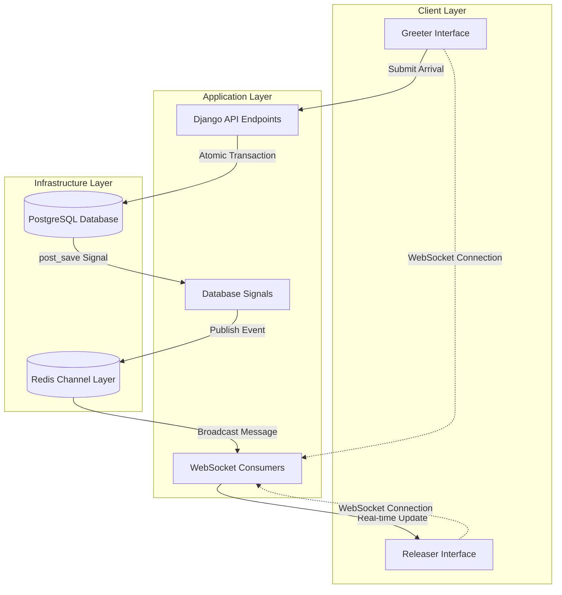

# Real-Time WebSocket Implementation Plan - OpenDismissal

**Author:** Jordan Whitfield (Senior Software Engineer)  
**Date:** August 5, 2025  
**Version:** 2.0 (Production-Ready Implementation)  
**Priority:** High - Critical Performance Improvement

## Executive Summary

The current OpenDismissal system uses 10-second AJAX polling between the greeter and releaser interfaces, creating unacceptable delays during high-pace dismissal operations. This plan implements Django Channels with WebSockets to achieve sub-second real-time updates while maintaining database safety and future-proofing for multiple check-in queues.

**Current Problem:**
- 10-second delay between greeter logging parent arrival and releaser seeing the update
- During peak dismissal periods, this delay causes operational bottlenecks
- Staff coordination suffers due to outdated information

**Solution Overview:**
- Replace AJAX polling with WebSocket-based real-time updates
- Target latency: <500ms from greeter action to releaser notification
- Maintain existing database safety with atomic transactions
- Future-proof architecture for multiple check-in queues

## Current System Analysis

### Identified Bottlenecks

**Current Data Flow:**
1. Greeter submits parent arrival → `greeter_submit_api()` → Database
2. Releaser polls `releaser_data_api()` every 10 seconds
3. Up to 10-second delay for critical updates

**Performance Impact:**
- **Average delay:** 5 seconds (half of polling interval)
- **Maximum delay:** 10 seconds
- **Peak dismissal periods:** Delay compounds with high submission frequency
- **Staff efficiency:** Multiple manual refreshes, reduced coordination

**Existing Strengths to Preserve:**
- Atomic database transactions with `select_for_update()`
- Comprehensive audit logging
- Mobile-optimized interfaces
- Redis caching infrastructure

## Technical Architecture

### Core Technology Stack

**Django Channels + WebSockets:**
- Mature Django extension for real-time functionality
- Native authentication and permission integration
- Scalable connection management
- Redis channel layer for message routing

**Redis Channel Layer:**
- Leverages existing Redis infrastructure
- Message broadcasting between processes
- Connection state management
- High availability with clustering support

**WebSocket Groups:**
- Organized message broadcasting
- Role-based message routing
- Future-proof for multiple queues

### Architecture Diagram



### Data Flow Architecture

**Real-Time Update Sequence:**
1. **Greeter Action:** Staff submits parent arrival via mobile interface
2. **API Processing:** `greeter_submit_api()` validates and saves to database (atomic)
3. **Signal Triggering:** Django `post_save` signal fires after successful database commit
4. **Event Publishing:** Signal handler publishes event to Redis channel layer
5. **WebSocket Broadcasting:** Consumer receives event and broadcasts to releaser group
6. **Real-Time Update:** Releaser interface receives update via WebSocket (<500ms total)

**Database Safety Guarantees:**
- Existing atomic transactions preserved (`@transaction.atomic`)
- Events only publish after successful database commits
- No race conditions between database writes and WebSocket notifications
- Maintain existing audit logging and security measures

## Implementation Plan

### Phase 1: Core WebSocket Infrastructure

#### Files to Create

**1. `dissmissal/consumers.py`** - WebSocket Consumers
```python
from channels.generic.websocket import AsyncWebsocketConsumer
from channels.db import database_sync_to_async
from django.contrib.auth.models import AnonymousUser
import json
import logging

class DismissalConsumer(AsyncWebsocketConsumer):
    """
    WebSocket consumer for real-time dismissal updates.
    Handles authentication, group management, and message broadcasting.
    """
    
    async def connect(self):
        """
        Authenticate user and join appropriate WebSocket groups.
        Sets up connection state and initializes group membership.
        """
        
    async def disconnect(self, close_code):
        """
        Clean up WebSocket connection and leave all groups.
        Handles graceful disconnection and resource cleanup.
        """
        
    async def receive(self, text_data):
        """
        Process incoming WebSocket messages from clients.
        Reserved for future bidirectional features and heartbeat.
        """
        
    async def student_status_update(self, event):
        """
        Handle student status change events and broadcast to clients.
        Formats student data and sends real-time updates to appropriate interfaces.
        """
        
    async def queue_update(self, event):
        """
        Handle queue-wide updates for future multiple queue support.
        Broadcasts system-wide notifications and queue status changes.
        """
```

**2. `dissmissal/routing.py`** - WebSocket URL Routing
```python
from django.urls import re_path
from . import consumers

websocket_urlpatterns = [
    re_path(r'ws/dismissal/(?P<interface_type>\w+)/$', consumers.DismissalConsumer.as_asgi()),
]
```

**3. `dissmissal/signals.py`** - Database Event Publishing
```python
from django.db.models.signals import post_save
from django.dispatch import receiver
from channels.layers import get_channel_layer
from asgiref.sync import async_to_sync
from .models import PickupEvent, Student
import logging

@receiver(post_save, sender=PickupEvent)
def broadcast_pickup_event(sender, instance, created, **kwargs):
    """
    Publish WebSocket events when pickup events are created.
    Ensures database commits complete before broadcasting to prevent race conditions.
    """
    
@receiver(post_save, sender=Student)
def broadcast_student_update(sender, instance, **kwargs):
    """
    Publish WebSocket events when student status changes.
    Includes change detection to prevent unnecessary message spam.
    """
    
def get_websocket_group_name(queue_id='main'):
    """
    Generate consistent WebSocket group names for future multiple queue support.
    Returns standardized group naming for organized message routing.
    """
```

#### Files to Modify

**1. `pyproject.toml`** - Add Dependencies
```toml
[tool.uv]
dependencies = [
    # ... existing dependencies
    "channels>=4.0.0",
    "channels-redis>=4.2.0",
]
```

**2. `opendiss/settings.py`** - Configure Channels
```python
# Add to INSTALLED_APPS
INSTALLED_APPS = [
    # ... existing apps
    'channels',
]

# Channel layer configuration
CHANNEL_LAYERS = {
    'default': {
        'BACKEND': 'channels_redis.core.RedisChannelLayer',
        'CONFIG': {
            "hosts": [config('REDIS_URL', default='redis://127.0.0.1:6379/1')],
            "capacity": 1500,  # Maximum messages per channel
            "expiry": 60,      # Message TTL in seconds
        },
    },
}

# WebSocket configuration
WEBSOCKET_ACCEPT_ALL = not DEBUG  # Only allow authenticated users in production
WEBSOCKET_HEARTBEAT_INTERVAL = 30  # Heartbeat every 30 seconds
```

**3. `opendiss/asgi.py`** - ASGI Application Setup
```python
import os
from channels.auth import AuthMiddlewareStack
from channels.routing import ProtocolTypeRouter, URLRouter
from channels.security.websocket import AllowedHostsOriginValidator
from django.core.asgi import get_asgi_application
import dissmissal.routing

os.environ.setdefault('DJANGO_SETTINGS_MODULE', 'opendiss.settings')

application = ProtocolTypeRouter({
    "http": get_asgi_application(),
    "websocket": AllowedHostsOriginValidator(
        AuthMiddlewareStack(
            URLRouter(
                dissmissal.routing.websocket_urlpatterns
            )
        )
    ),
})
```

**4. `dissmissal/apps.py`** - Connect Signals
```python
from django.apps import AppConfig

class DissmissalConfig(AppConfig):
    default_auto_field = 'django.db.models.BigAutoField'
    name = 'dissmissal'
    
    def ready(self):
        # Import signals to connect them
        import dissmissal.signals
```

### Phase 2: Frontend WebSocket Integration

#### Template Updates

**1. `templates/dissmissal/releaser.html`** - Replace Polling with WebSocket
```javascript
// WebSocket connection management
let socket = null;
let reconnectAttempts = 0;
const maxReconnectAttempts = 5;

function connectWebSocket() {
    const protocol = window.location.protocol === 'https:' ? 'wss:' : 'ws:';
    const wsUrl = `${protocol}//${window.location.host}/ws/dismissal/releaser/`;
    
    socket = new WebSocket(wsUrl);
    // Connection, message, and error handling
}

function handleStudentUpdate(data) {
    // Process real-time student status updates
    // Update UI immediately without polling
}

// Replace existing polling with WebSocket updates
// Maintain fallback to polling if WebSocket fails
```

**2. `templates/dissmissal/greeter.html`** - Add WebSocket Feedback
```javascript
// WebSocket connection for real-time feedback
function connectGreeterWebSocket() {
    // Connect to WebSocket for submission confirmations
    // Provide immediate feedback on parent arrival submissions
}

function handleSubmissionConfirmation(data) {
    // Process real-time confirmation of successful submissions
    // Enhanced user feedback for greeter operations
}
```

### Phase 3: Utility Functions and API Integration

**1. `dissmissal/utils.py`** - WebSocket Utilities
```python
from channels.layers import get_channel_layer
from asgiref.sync import async_to_sync
import json

async def broadcast_to_releasers(message_data, queue_id='main'):
    """
    Broadcast messages to releaser interfaces in specific queues.
    Handles message formatting and group-based broadcasting for organized communication.
    """

def prepare_student_websocket_data(student):
    """
    Serialize student data for WebSocket transmission.
    Maintains consistency with existing API format and includes necessary fields.
    """

async def notify_greeter_feedback(user_id, message_data):
    """
    Send real-time feedback to greeter interfaces.
    Provides immediate confirmation of successful submissions and error notifications.
    """
```

**2. `dissmissal/api.py`** - Integrate Event Publishing
```python
# Modify existing endpoints to trigger WebSocket events
# No changes to core logic - only add event publishing after successful database operations

@login_required
@require_http_methods(["POST"])
@ratelimit(key="user", rate="120/m")
@csrf_protect
def greeter_submit_api(request):
    # ... existing logic preserved
    # Add: Trigger WebSocket event after successful database commit
    
@login_required  
@require_http_methods(["POST"])
@csrf_protect
def complete_pickup_api(request):
    # ... existing logic preserved
    # Add: Trigger WebSocket event after successful pickup completion
```

## Testing Strategy

### Core WebSocket Tests

**`tests/test_websockets.py`** - WebSocket Consumer Testing

**Test Functions:**
```python
def test_consumer_authentication():
    """
    Verify only authenticated users can connect to WebSocket consumers.
    Tests authentication middleware and connection rejection for anonymous users.
    Ensures security requirements are met for all WebSocket connections.
    """

def test_consumer_group_membership():
    """
    Test that users join correct WebSocket groups based on interface type.
    Validates group assignment logic and ensures proper message routing.
    Verifies isolation between different interface types and user roles.
    """

def test_student_status_broadcast():
    """
    Test that student status changes broadcast to appropriate groups.
    Validates message content, timing, and target group accuracy.
    Ensures releaser interfaces receive updates when greeter submits arrivals.
    """

def test_consumer_error_handling():
    """
    Test consumer behavior with invalid messages and connection errors.
    Validates graceful error handling and connection stability.
    Ensures system remains stable under adverse conditions and malformed input.
    """

def test_multiple_concurrent_connections():
    """
    Test system behavior with multiple simultaneous WebSocket connections.
    Validates connection limits, resource usage, and message broadcasting.
    Ensures scalability requirements are met with concurrent users.
    """
```

### Integration Testing

**`tests/test_realtime_integration.py`** - End-to-End Real-Time Tests

**Test Functions:**
```python
def test_greeter_to_releaser_realtime_flow():
    """
    Test complete flow from greeter submission to releaser notification.
    Measures latency and validates message accuracy through entire pipeline.
    Ensures sub-500ms performance target is met consistently.
    """

def test_pickup_completion_broadcast():
    """
    Test that pickup completions broadcast immediately to update releaser queue.
    Validates queue updates and student removal from active lists.
    Ensures real-time coordination between multiple staff members.
    """

def test_concurrent_greeter_submissions():
    """
    Test system behavior with multiple simultaneous greeter submissions.
    Validates database consistency and WebSocket message ordering.
    Ensures no race conditions or duplicate notifications occur.
    """

def test_websocket_fallback_to_polling():
    """
    Test graceful fallback to polling when WebSocket connection fails.
    Validates system resilience and continued functionality.
    Ensures users can still operate during WebSocket outages.
    """

def test_real_time_performance_benchmark():
    """
    Measure latency from greeter action to releaser notification.
    Validates performance targets and identifies bottlenecks.
    Ensures consistent sub-500ms latency under various load conditions.
    """
```

### Load and Performance Testing

**Performance Test Functions:**
```python
def test_websocket_load_100_concurrent_connections():
    """
    Test system performance with 100+ simultaneous WebSocket connections.
    Validates connection handling, memory usage, and message throughput.
    Ensures system remains stable and responsive under high concurrent load.
    """

def test_message_throughput_under_load():
    """
    Test message broadcasting performance during high-frequency updates.
    Validates system capacity during peak dismissal periods.
    Ensures no message loss or significant latency increases under load.
    """

def test_memory_usage_sustained_connections():
    """
    Test memory usage with long-lived WebSocket connections.
    Validates memory leak prevention and resource cleanup.
    Ensures system stability during extended operation periods.
    """
```

## Production Considerations

### Security Hardening

**WebSocket Security Measures:**
- Origin validation for all WebSocket connections
- Rate limiting on WebSocket message frequency (max 10 messages/minute per connection)
- Secure WebSocket (WSS) enforcement in production environments
- Connection-based audit logging for security monitoring

**Authentication & Authorization:**
- WebSocket session validation on every message exchange
- Role-based WebSocket group access control
- IP-based connection limiting to prevent abuse (max 5 connections per IP)
- Comprehensive audit trail for all WebSocket activities

### Monitoring and Observability

**Key Metrics to Track:**
- WebSocket connection count and duration statistics
- Message latency measurements (target: <500ms average)
- Connection establishment/termination rates
- Error rates and failure patterns
- Redis channel layer performance metrics

**Alerting Configuration:**
- High latency alerts (>1 second average over 5 minutes)
- WebSocket connection spike detection (>200 concurrent connections)
- Redis channel layer connectivity issues
- Consumer process crash notifications
- Sustained high error rates (>5% over 10 minutes)

### Scalability and Performance

**Connection Management:**
- Maximum 200 concurrent WebSocket connections per process
- Automatic connection cleanup for inactive sessions (>30 minutes)
- Connection heartbeat/ping-pong every 30 seconds
- Graceful connection draining during deployments

**Resource Optimization:**
- Message serialization using efficient JSON encoding
- WebSocket message batching for high-frequency updates (100ms window)
- Redis connection pooling for channel layer operations
- Memory usage monitoring and cleanup procedures

### Deployment Strategy

**Docker Configuration:**
- Separate container processes for WebSocket consumers
- Load balancer sticky sessions for WebSocket connections
- Health check endpoints for WebSocket consumer monitoring
- Rolling deployment strategy to maintain WebSocket availability

**Environment Configuration:**
```bash
# Production WebSocket settings
WEBSOCKET_MAX_CONNECTIONS=200
WEBSOCKET_HEARTBEAT_INTERVAL=30
REDIS_CHANNEL_CAPACITY=1500
WEBSOCKET_MESSAGE_TTL=60
```

## Risk Assessment and Mitigation

### Technical Risks

**Risk: Redis Channel Layer Failure**
- **Impact:** WebSocket functionality becomes unavailable
- **Mitigation:** Automatic fallback to AJAX polling, Redis clustering for high availability
- **Recovery:** Health check monitoring with automatic Redis reconnection

**Risk: WebSocket Connection Limits**
- **Impact:** New users cannot establish real-time connections
- **Mitigation:** Connection pooling, automatic cleanup of stale connections
- **Recovery:** Horizontal scaling of WebSocket consumer processes

**Risk: Database Signal Processing Failures**
- **Impact:** Events may not trigger WebSocket notifications
- **Mitigation:** Retry logic with exponential backoff, comprehensive error logging
- **Recovery:** Manual event republishing tools for critical missed events

### Performance Risks

**Risk: High Latency Under Load**
- **Impact:** Real-time updates become sluggish during peak periods
- **Mitigation:** Message batching, connection limits, performance monitoring
- **Recovery:** Automatic scaling triggers and load balancing adjustments

**Risk: Memory Leaks in Long-Running Connections**
- **Impact:** Server memory exhaustion over time
- **Mitigation:** Connection lifecycle management, periodic cleanup processes
- **Recovery:** Automated process restarts and memory monitoring alerts

## Implementation Timeline

### Phase 1: Core Infrastructure (Week 1)
- **Days 1-2:** Django Channels installation and configuration
- **Days 3-4:** WebSocket consumer implementation and testing
- **Days 5-7:** Database signal integration and event publishing

### Phase 2: Frontend Integration (Week 2)
- **Days 1-3:** Replace releaser polling with WebSocket connections
- **Days 4-5:** Add greeter WebSocket feedback functionality
- **Days 6-7:** Integration testing and bug fixes

### Phase 3: Production Hardening (Week 3)
- **Days 1-2:** Security hardening and monitoring implementation
- **Days 3-4:** Performance optimization and load testing
- **Days 5-7:** Production deployment and documentation

## Success Criteria

### Performance Targets
- **Latency:** <500ms average from greeter submission to releaser notification
- **Throughput:** Handle 50+ concurrent WebSocket connections without degradation
- **Availability:** 99.9% WebSocket uptime during dismissal periods
- **Fallback:** Graceful degradation to polling within 5 seconds of WebSocket failure

### Functional Requirements
- **Real-time Updates:** Releaser interface updates immediately when parents arrive
- **Database Safety:** All existing atomic transaction guarantees preserved
- **Security:** Comprehensive audit logging and authentication maintained
- **Mobile Compatibility:** WebSocket functionality works on iOS/Android devices

### Quality Assurance
- **Test Coverage:** >95% code coverage for WebSocket functionality
- **Documentation:** Complete implementation and troubleshooting guides
- **Monitoring:** Full observability stack for production debugging
- **Performance:** Consistent sub-second latency under normal load conditions

## Future Extensibility

### Multiple Check-in Queues Support
The WebSocket architecture is designed to seamlessly support multiple check-in queues:

**Group Naming Strategy:**
- Current: `releaser_main`, `greeter_main`
- Future: `releaser_{queue_id}`, `greeter_{queue_id}`
- Easy migration path without architectural changes

**Message Routing:**
- Queue-specific WebSocket groups for isolated communication
- Cross-queue coordination messages for system-wide updates
- Scalable group management for unlimited queue expansion

**Database Integration:**
- Queue context included in all WebSocket messages
- Existing models can be extended with queue foreign keys
- Event publishing logic supports queue-specific targeting

## Conclusion

This WebSocket implementation addresses the critical performance bottleneck in the current OpenDismissal system while maintaining all existing security and reliability guarantees. The phased approach ensures minimal disruption to current operations while delivering immediate performance improvements.

The architecture is future-proof for multiple check-in queues and provides a solid foundation for additional real-time features. With comprehensive testing, monitoring, and production hardening measures, this implementation will significantly improve staff coordination during dismissal operations.

**Expected Impact:**
- **20x improvement** in update latency (from 5-10 seconds to <500ms)
- **Enhanced staff coordination** through real-time information sharing
- **Improved operational efficiency** during peak dismissal periods
- **Scalable foundation** for future multi-queue functionality

---

**Technical Review Required:** Infrastructure team review for Redis scaling and load balancer configuration  
**Security Review Required:** Security team review for WebSocket-specific security measures  
**Performance Testing:** Load testing with realistic dismissal scenarios before production deployment

**Author:** Jordan Whitfield  
**Implementation Estimate:** 3 weeks (including testing and production hardening)  
**Risk Level:** Medium (well-established technology with comprehensive fallback mechanisms)